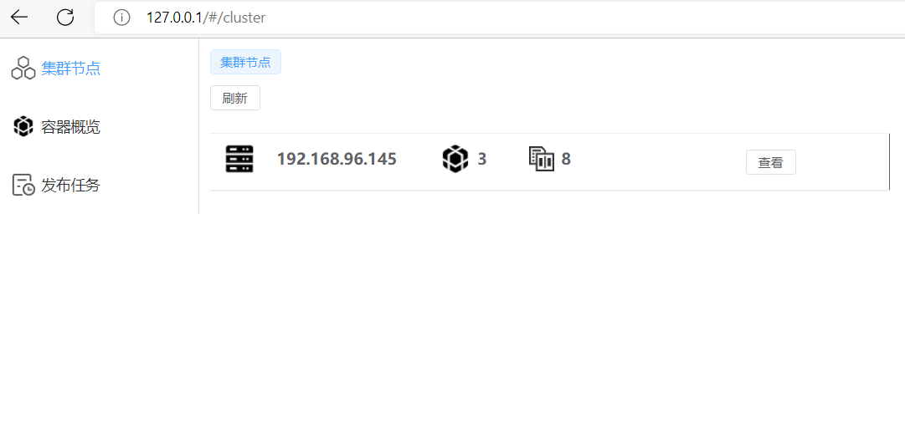
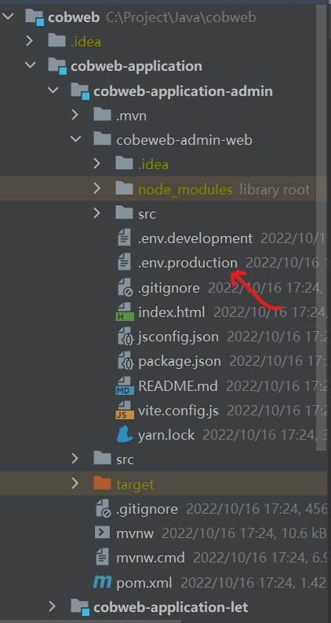

#Cobweb 
Docker集群管理+Java项目自动发布系统

由两大组件构成 cobweb-admin和cobweb-let

###cobweb-admin:
负责集群管理，Git拉取代码，Maven构建，集群节点调度。提供web控制台。

###cobweb-let:
接管本机docker环境，与cobweb-admin通信，听从cobweb-admin指挥操作docker

##安装教程
###1.初始化一个集群，
选择一台Linux服务器作为集群主节点，安装Git,Maven,Docker，安装cobweb-admin
上传cobweb-admin的jar包，java -jar直接启动即可，启动完成会生成cobweb-let的启动命令

###2.加入集群，
在你想要加入集群管理的Linux服务器上上传cobweb-let的jar包，
使用cobweb-admin生成的启动命令启动。安装Docker

###3.访问web控制台，点击刷新，集群节点显示出所有服务器，安装成功

####前端目录，修改.env.production配置文件baseURL地址为cobweb-admin部署的地址

